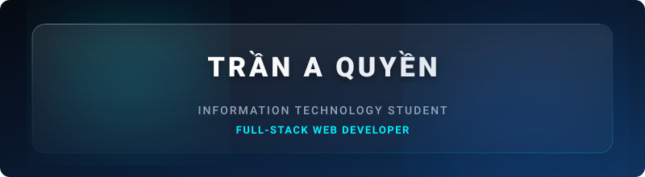
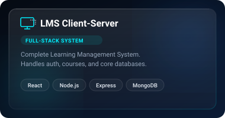
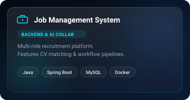
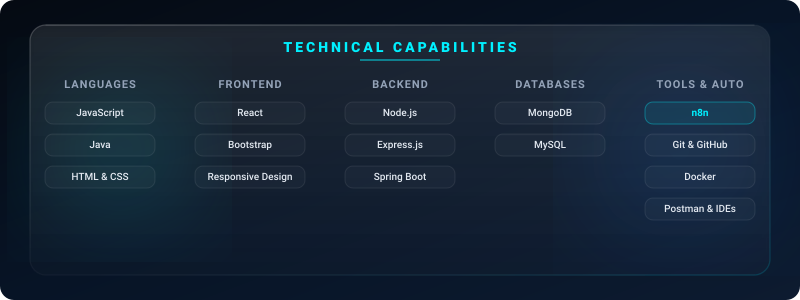

<!-- Glassmorphic Header Banner -->

 
 

<!-- Quick Social Links -->

---

## About Me

I am **Trần A Quyền**, an Information Technology student and a full-stack web developer focused on building practical, maintainable applications. I enjoy turning product requirements into clear user flows, reliable APIs, and interfaces that are simple to use.

My current work centers on JavaScript-based web development, especially React on the client side and Node.js/Express on the server side. I am also strengthening my foundation in Java, database design, REST APIs, authentication, system design, and workflow automation.

### Profile Highlights
* **Major:** Information Technology
* **Focus:** Full-Stack Web Development (React / Node.js)
* **Core Strengths:**
  * Developing secure and efficient **REST APIs**
  * Building scalable **Client-Server Architecture**
  * Designing structured **Database-backed applications**
  * Writing **clean, self-documenting code**
* **Currently Exploring & Learning:**
  * Advanced React structure & state management
  * Enterprise Node.js backend architecture
  * Workflow automation & integrations with **n8n**
  * System design & software architecture fundamentals

---

## Featured Projects

We design systems with microservice mindset and clean client-server boundaries. Click on the cards below to explore the repositories:

<table border="0" cellpadding="0" cellspacing="0">
  <tr>
    <td width="380" align="center" valign="top" style="border: none;">
      
    </td>
    <td width="380" align="center" valign="top" style="border: none;">
      
    </td>
  </tr>
</table>

---

## Technical Skills

  

---

## GitHub Metrics

<table border="0" cellpadding="0" cellspacing="0">
  <tr>
    <td valign="top" style="border: none;">
      
    </td>
    <td valign="top" style="border: none;">
      
    </td>
  </tr>
</table>

 

 
 

---

### Let's Build Something Useful

I am open to internships, collaboration, and projects where I can contribute, learn, and grow as a software developer.

[Connect on LinkedIn](https://www.linkedin.com/in/tran-a-quyen) · [Send Email](mailto:tranaquyen0904@gmail.com)

